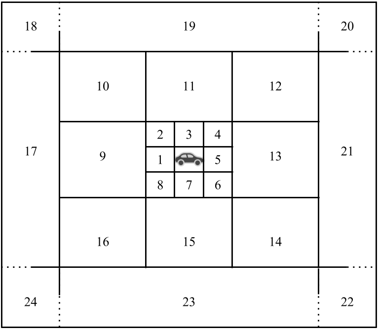
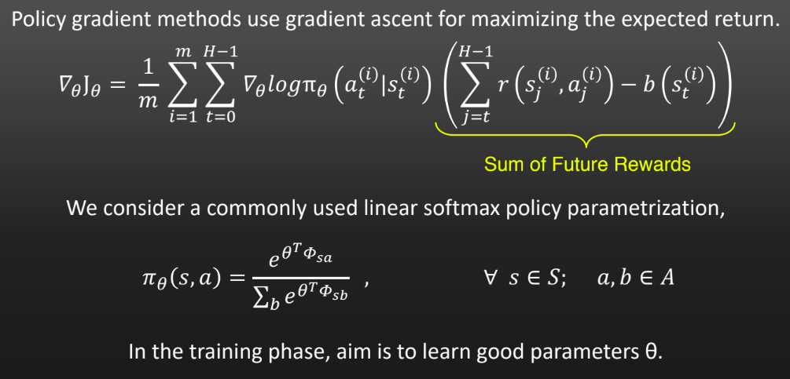
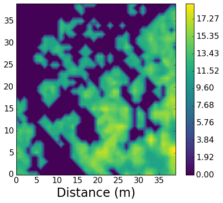
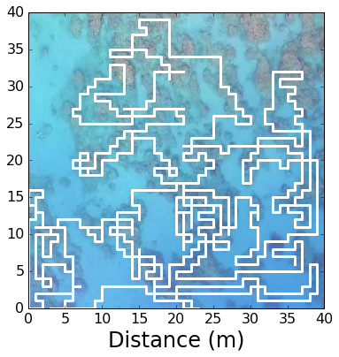
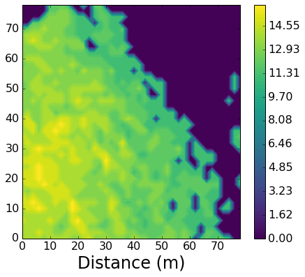
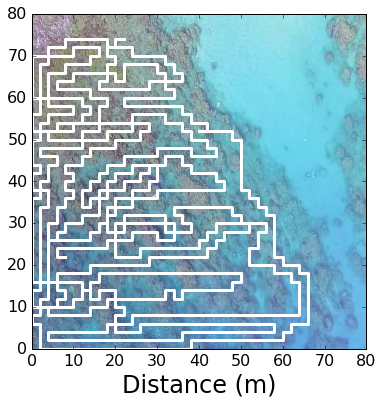
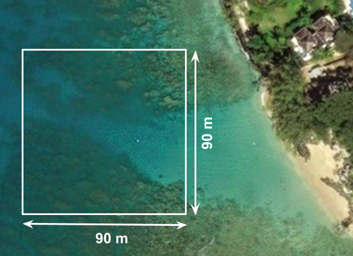
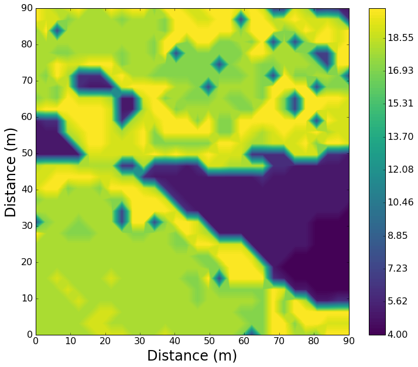
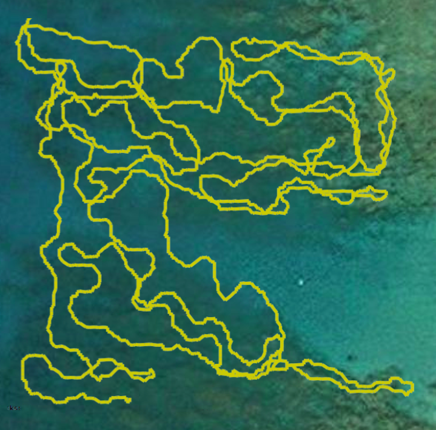

# Active Sampling with Non-uniform Feature Aggregation with motion primitives

This project presents an adaptive sampling technique that generates paths to efficiently measure and 
then mathematically model a scalar field by performing non-uniform measurements in a given street network. 
The system is trained to achieve paths that preferentially cover hotspots at the earlier stages of the exploration. 
These learned parameters then define a policy π (in the sense of reinforcement learning) that is then used on the 
scoremap to generate an explicit action plan.

# Feature Aggregation:

We use a multi-resolution feature aggregation resulting in a fixed number (24) of features irrespective of the size
of the search region. Features corresponding to larger cells are assigned a value equal to the average of values of 
that fall in that cell. The feature cells grow in size along with the distance from the robot location. 
Thus, areas close to the robot are represented with high resolution and areas further from the robot are 
represented in lower resolution. The aggregated feature design is only used to achieve better
policy search, but the robot action is still defined at the grid-cell level. For further details, please check out 
our papers [SSRR2018](http://www.cim.mcgill.ca/~mrl/pubs/sandeep/SSRR2018.pdf) and [ISER2018](http://www.cim.mcgill.ca/~mrl/pubs/sandeep/ISER2018.pdf).

# Libraries Required:
		-numpy
		-GPy
		-cv2
		-scipy
    
# Command to run the policy gradient learning algorithm:

python learn_policyGradient_params.py <fileNm_to_save_learnt_params> <learning_rate_Eta>   
Currently in the provided examples, the learning rate Eta=0.015.

# Command to run the path generator code in street network:

python ../scripts/pg_path_generator.py

# Example files provided:
	
	-trainingData:
		1. gaussian_mixture_training_data.pkl - This file contains a reward map used for learning the policy parameters

	-testingData:
		1. gaussian_model_100iter_trial1.pkl - Data from an example test run to learn parameters are stored in this file. This can be directly used to test the code in pg_path_generator.py

		2. gaussian_mixture_test1.pkl - Test distribution generated with a mixture of two Gaussians.
		
		3. gaussian_mixture_test3.pkl - Test distribution generated with a mixture of three Gaussians.

		4. cShaped_test3.pkl - Test distribution generated with a mixture of Gaussian and a C-shaped distribution.

# Below are some examples:

## Example Runs:

# References:

- S. Manjanna, H. van Hoof, and G. Dudek. Reinforcement Learning with Non-uniform State Representations
for Adaptive Search, to appear in Proc. of Intl. Symposium on Experimental Robotics (ISER’18), Buenos Aires,
Argentina, Nov 2018.

- S. Manjanna, H. van Hoof, and G. Dudek. Policy Search on Aggregated State Space for Active Sampling, in
Proc. of IEEE Intl. Symposium on Safety, Security, and Rescue Robotics (SSRR’18), Philadelphia, USA, Aug 2018.

- [Policy Search on Aggregated State Space for Active Sampling](https://www.youtube.com/watch?v=3YyQNu_ICiE&t=5s)
